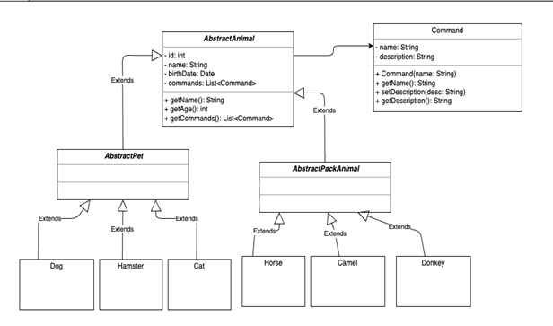
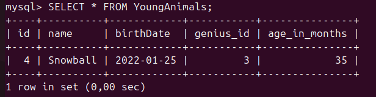
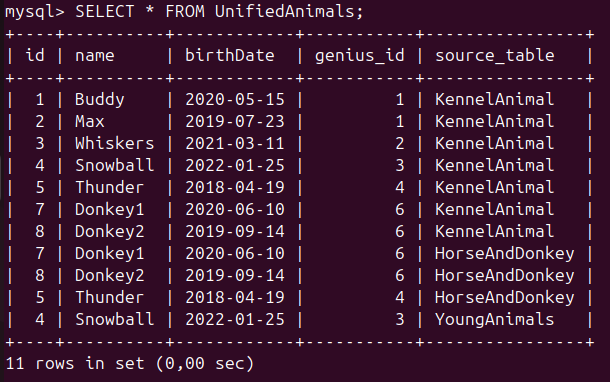

# Итоговая контрольная работа #


## Информация о проекте: ##

*Необходимо организовать систему учета для питомника в котором живут домашние и вьючные животные.*

### Как сдавать проект
*Для сдачи проекта необходимо создать отдельный общедоступный репозиторий(Github, gitlub, или Bitbucket). Разработку вести в этом репозитории, использовать пул реквесты на изменения. Программа должна запускаться и работать, ошибок при выполнении программы быть не должно. Программа, может использоваться в различных системах, поэтому необходимо разработать класс в виде конструктора.*

## Задание
1.	Используя команду cat в терминале операционной системы Linux, создать два файла Домашние животные (заполнив файл собаками, кошками, хомяками) и Вьючные животными заполнив файл Лошадьми, верблюдами и ослы), а затем объединить их. Просмотреть содержимое созданного файла. Переименовать файл, дав ему новое имя (Друзья человека).
2.	Создать директорию, переместить файл туда.
3.	Подключить дополнительный репозиторий MySQL. Установить любой пакет из этого репозитория.
4.	Установить и удалить deb-пакет с помощью dpkg.
5.	Выложить историю команд в терминале ubuntu
6.	Нарисовать диаграмму, в которой есть класс родительский класс, домашние животные и вьючные животные, в составы которых в случае домашних животных войдут классы: собаки, кошки, хомяки, а в класс вьючные животные войдут: Лошади, верблюды и ослы).
 
7.	В подключенном MySQL репозитории создать базу данных “Друзья человека”
8.	Создать таблицы с иерархией из диаграммы в БД
9.	Заполнить низкоуровневые таблицы именами(животных), командами которые они выполняют и датами рождения
10.	Удалить из таблицы верблюдов, т.к. верблюдов решили перевезти в другой питомник на зимовку. Объединить таблицы лошади, и ослы в одну таблицу.
11.	Создать новую таблицу “молодые животные” в которую попадут все животные старше 1 года, но младше 3 лет и в отдельном столбце с точностью до месяца подсчитать возраст животных в новой таблице
12.	Объединить все таблицы в одну, при этом сохраняя поля, указывающие на прошлую принадлежность к старым таблицам.
13.	Создать класс с Инкапсуляцией методов и наследованием по диаграмме.
14.	Написать программу, имитирующую работу реестра домашних животных.
В программе должен быть реализован следующий функционал:
14.1 Завести новое животное
14.2 Определять животное в правильный класс
14.3 Увидеть список команд, которое выполняет животное
14.4 Обучить животное новым командам
14.5 Реализовать навигацию по меню
15.	Создайте класс Счетчик, у которого есть метод add(), увеличивающий̆ значение внутренней̆ int переменной̆ на 1 при нажатие “Завести новое животное” Сделайте так, чтобы с объектом такого типа можно было работать в блоке try-with-resources. Нужно бросить исключение, если работа с объектом типа счетчик была не в ресурсном try и/или ресурс остался открыт. Значение считать в ресурсе try, если при заведения животного заполнены все поля.
 
## Решение:

1.	Используя команду cat в терминале операционной системы Linux, создать два файла Домашние животные (заполнив файл собаками, кошками, хомяками) и Вьючные животными заполнив файл Лошадьми, верблюдами и ослы), а затем объединить их. Просмотреть содержимое созданного файла. Переименовать файл, дав ему новое имя (Друзья человека).

```bash
cat > home_animals.txt
Собака
Кошка
Хомяк
cat > pack_animals.txt
Лошадь
Верблюд
Осел
cat home_animals.txt pack_animals.txt > all_animals.txt
cat all_animals.txt
Собака
Кошка
Хомяк
Лошадь
Верблюд
Осел
mv all_animals.txt human_friends.txt
```

2.	Создать директорию, переместить файл туда.
```bash
mkdir animals
mv human_friends.txt animals/
ls animals/
```

3.	Подключить дополнительный репозиторий MySQL. Установить любой пакет из этого репозитория.
```bash
sudo apt-get update
sudo apt-get install -y software-properties-common
sudo add-apt-repository 'deb http://repo.mysql.com/apt/ubuntu/ focal mysql-8.0'
curl -fsSL https://repo.mysql.com/RPM-GPG-KEY-mysql-2022 | sudo gpg --dearmor -o /usr/share/keyrings/mysql-archive-keyring.gpg
sudo nano /etc/apt/sources.list.d/mysql.list -> deb [trusted=yes] http://repo.mysql.com/apt/ubuntu/ noble mysql-8.0
apt-cache policy mysql-server
mysql-server:
  Установлен: 8.0.40-1ubuntu24.04
  Кандидат:   8.0.40-1ubuntu24.04
  Таблица версий:
 *** 8.0.40-1ubuntu24.04 500
        500 http://repo.mysql.com/apt/ubuntu noble/mysql-8.0 amd64 Packages
        100 /var/lib/dpkg/status
     8.0.40-0ubuntu0.24.04.1 500
        500 http://ru.archive.ubuntu.com/ubuntu noble-updates/main amd64 Packages
        500 http://security.ubuntu.com/ubuntu noble-security/main amd64 Packages
     8.0.36-2ubuntu3 500
500	tp://ru.archive.ubuntu.com/ubuntu noble/main amd64 Packages
```

4.	Установить и удалить deb-пакет с помощью dpkg.
```bash
wget http://cz.archive.ubuntu.com/ubuntu/pool/universe/v/vlc/vlc_3.0.20-3build6_amd64.deb
sudo apt-get install -f
dpkg -l | grep vlc
ii  libvlc-bin:amd64                              3.0.20-3build6                           amd64        tools for VLC's base library
ii  libvlc5:amd64                                 3.0.20-3build6                           amd64        multimedia player and streamer library
ii  libvlccore9:amd64                             3.0.20-3build6                           amd64        base library for VLC and its modules
ii  vlc                                           3.0.20-3build6                           amd64        multimedia player and streamer
ii  vlc-bin                                       3.0.20-3build6                           amd64        binaries from VLC
ii  vlc-data                                      3.0.20-3build6                           all          common data for VLC
ii  vlc-plugin-base:amd64                         3.0.20-3build6                           amd64        multimedia player and streamer (base plugins)
ii  vlc-plugin-qt:amd64                           3.0.20-3build6                           amd64        multimedia player and streamer (Qt plugin)
ii  vlc-plugin-video-output:amd64                 3.0.20-3build6                           amd64        multimedia player and streamer (video output plugins)
sudo dpkg --purge vlc
sudo apt-get remove --purge vlc* libvlc* -y
sudo apt-get autoremove --purge -y
```
5.	Выложить историю команд в терминале ubuntu
```bash
history
500  cat > home_animals.txt
  501  cat > home_animals.txt
  502  nano home_animals.txt
  503  cat > pack_animals.txt
  504  nano pack_animals.txt
  505  cat home_animals.txt pack_animals.txt > all_animals.txt
  506  cat all_animals.txt
  507  mv all_animals.txt human_friends.txt
  508  ls
  509  cat human_friends.txt
  510  mkdir animals
  511  mv human_friends.txt animals/
  512  ls animals/
  513  code .
  514  sudo snap install code
  515  sudo snap install code --classic
  516  code
  517  mkdir -p ~/animal_registry
  518  python3 --version
  519  sudo apt update
  520  sudo apt install mysql-server mysql-client
  521  sudo mysql_secure_installation
  522  sudo mysql
  523  mysql -u root -p
  524  sudo systemctl status mysql
  525  pip3 install mysql-connector-python
  526  sudo apt install python3-pip
  527  sudo apt update
  528  sudo apt install git
  529  git config --global credential.helper manager
  530  sudo apt install git-credential-manager-core
  531  wget https://github.com/GitCredentialManager/git-credential-manager/releases/download/v2.0.931/gcmcore-linux_amd64.2.0.931.deb
  532  wget https://github.com/git-ecosystem/git-credential-manager/releases/download/v2.6.1/gcm-linux_amd64.2.6.1.deb
  533  sudo dpkg -i gcm-linux_amd64.2.6.1.deb 
  534  git config --global credential.helper manager-core
  535  git credential-manager-core --version
  536  which git-credential-manager-core
  537  sudo snap install git-credential-manager --classic
  538  nano ~/.gitconfig
  539  git push -u origin main
  540  sudo apt-get update
  541  sudo apt-get install -y software-properties-common
  542  sudo add-apt-repository 'deb http://repo.mysql.com/apt/ubuntu/ focal mysql-8.0'
  543  sudo apt-get update
  544  cat /etc/apt/sources.list.d/mysql.list
  545  curl -fsSL https://repo.mysql.com/RPM-GPG-KEY-mysql-2022 | sudo tee /etc/apt/trusted.gpg.d/mysql.asc
  546  sudo apt-get update
  547  curl -fsSL https://repo.mysql.com/RPM-GPG-KEY-mysql-2022 | sudo gpg --dearmor -o /usr/share/keyrings/mysql-archive-keyring.gpg
  548  sudo nano /etc/apt/sources.list.d/mysql.list
  549  sudo apt-get update
  550  curl -fsSL https://repo.mysql.com/RPM-GPG-KEY-mysql | sudo gpg --dearmor -o /usr/share/keyrings/mysql-archive-keyring.gpg
  551  sudo apt update
  552  lsb_release -a
  553  sudo nano /etc/apt/sources.list.d/mysql.list
  554  curl -fsSL https://repo.mysql.com/RPM-GPG-KEY-mysql | sudo tee /etc/apt/trusted.gpg.d/mysql.asc
  555  sudo apt update
  556  sudo nano /etc/apt/sources.list.d/mysql.list
  557  sudo apt update
  558  sudo nano /etc/apt/sources.list.d/mysql.list
  559  sudo apt update
  560  sudo apt install mysql-server mysql-client
  561  sudo apt --fix-broken install
  562  sudo apt install mysql-server
  563  sudo nano /etc/apt/sources.list.d/mysql.list
  564  sudo apt update
  565  sudo apt install mysql-server mysql-client
  566  mysql --version
  567  apt-cache policy mysql-server
  568  sudo apt install mysql-client
  569  mysql --version
  570  wget http://archive.ubuntu.com/ubuntu/pool/universe/h/htop/htop_3.0.5-0.1_amd64.deb
  571  wget http://archive.ubuntu.com/ubuntu/pool/universe/v/vlc/vlc_3.0.11.1-0ubuntu1_amd64.deb
  572  wget http://cz.archive.ubuntu.com/ubuntu/pool/universe/v/vlc/vlc_3.0.20-3build6_amd64.deb
  573  sudo dpkg -i vlc_3.0.20-3build6_amd64.deb
  574  sudo apt-get install -f
  575  dpkg -l | grep vlc
  576  vlc
  577  sudo dpkg --purge vlc
  578  dpkg -l | grep vlc
  579  sudo apt-get remove --purge vlc* libvlc* -y
  580  sudo apt-get autoremove --purge -y
  581  dpkg -l | grep vlc
582	history
```
6.	Нарисовать диаграмму, в которой есть класс родительский класс, домашние животные и вьючные животные, в составы которых в случае домашних животных войдут классы: собаки, кошки, хомяки, а в класс вьючные животные войдут: Лошади, верблюды и ослы).

*Диаграмма классов:*



 
 
7.	В подключенном MySQL репозитории создать базу данных “Друзья человека”

```sql
mysql -u root -p
Enter password:  SecurePass123!
Welcome to the MySQL monitor.  Commands end with ; or \g.
Your MySQL connection id is 8
Server version: 8.0.40 MySQL Community Server - GPL

Copyright (c) 2000, 2024, Oracle and/or its affiliates.

Oracle is a registered trademark of Oracle Corporation and/or its
affiliates. Other names may be trademarks of their respective
owners.

Type 'help;' or '\h' for help. Type '\c' to clear the current input statement.

mysql> CREATE DATABASE friends_of_humans;
Query OK, 1 row affected (0,06 sec)

mysql> SHOW DATABASES;
+--------------------+
| Database           |
+--------------------+
| friends_of_humans  |
| information_schema |
| mysql              |
| performance_schema |
| sys                |
+--------------------+
5	rows in set (0,01 sec)
```
 
8.	Создать таблицы с иерархией из диаграммы в БД.
```bash
cd ~/animal_registry
nano create_tables.sql
```
```sql
-- SQL-скрипт для создания таблиц
CREATE TABLE Commands
(
    id INT PRIMARY KEY NOT NULL AUTO_INCREMENT COMMENT 'Уникальный идентификатор команды',
    name varchar(30) NOT NULL COMMENT 'Название команды',
    description varchar(255) COMMENT 'Описание команды',
    INDEX (name)
);

CREATE TABLE AnimalGroup
(
    id INT PRIMARY KEY NOT NULL AUTO_INCREMENT COMMENT 'Уникальный идентификатор группы',
    name varchar(30) NOT NULL COMMENT 'Название группы животных',
    INDEX (name)
);

CREATE TABLE AnimalGenius
(
    id INT PRIMARY KEY NOT NULL AUTO_INCREMENT COMMENT 'Уникальный идентификатор вида',
    name varchar(30) NOT NULL COMMENT 'Название вида',
    group_id INT NOT NULL COMMENT 'ID группы, к которой относится вид',
    FOREIGN KEY (group_id) REFERENCES AnimalGroup (id)
    ON DELETE CASCADE ON UPDATE CASCADE,
    INDEX (name)
);

CREATE TABLE KennelAnimal
(
    id INT PRIMARY KEY NOT NULL AUTO_INCREMENT COMMENT 'Уникальный идентификатор животного',
    name varchar(30) NOT NULL COMMENT 'Имя животного',
    birthDate DATE NOT NULL COMMENT 'Дата рождения животного',
    genius_id INT NOT NULL COMMENT 'ID вида животного',
    FOREIGN KEY (genius_id) REFERENCES AnimalGenius (id)
    ON DELETE CASCADE ON UPDATE CASCADE,
    INDEX (name)
);

CREATE TABLE AnimalCommands
(
    animal_id INT NOT NULL COMMENT 'ID животного',
    command_id INT NOT NULL COMMENT 'ID команды',
    PRIMARY KEY (animal_id, command_id),
    FOREIGN KEY (animal_id) REFERENCES KennelAnimal (id)
    ON DELETE CASCADE ON UPDATE CASCADE,
    FOREIGN KEY (command_id) REFERENCES Commands (id)
    ON DELETE CASCADE ON UPDATE CASCADE
);
```
```bash
mysql -u root -p friends_of_humans < create_tables.sql
```
```sql
mysql -u root -p
USE friends_of_humans;
mysql> SHOW TABLES;
+-----------------------------+
| Tables_in_friends_of_humans |
+-----------------------------+
| AnimalCommands              |
| AnimalGenius                |
| AnimalGroup                 |
| Commands                    |
| KennelAnimal                |
+-----------------------------+
5 rows in set (0,01 sec)
mysql> SHOW DATABASES;
+--------------------+
| Database           |
+--------------------+
| friends_of_humans  |
| information_schema |
| mysql              |
| performance_schema |
| sys                |
+--------------------+
5	rows in set (0,01 sec)
```


 
9.	Заполнить низкоуровневые таблицы именами(животных), командами которые они выполняют и датами рождения
```bash
mysql -u root -p
USE friends_of_humans;
```
```sql
INSERT INTO Commands (name, description)
VALUES
    ('Sit', 'The animal sits down.'),
    ('Stay', 'The animal remains in place.'),
    ('Come', 'The animal comes to the owner.'),
    ('Fetch', 'The animal retrieves an item.'),
    ('Roll Over', 'The animal rolls over.');

INSERT INTO AnimalGroup (name)
VALUES
    ('Domestic Animals'),
    ('Pack Animals');

INSERT INTO AnimalGenius (name, group_id)
VALUES
    ('Dogs', 1),  -- Dogs are domestic animals
    ('Cats', 1),  -- Cats are domestic animals
    ('Hamsters', 1),  -- Hamsters are domestic animals
    ('Horses', 2),  -- Horses are pack animals
    ('Camels', 2),  -- Camels are pack animals
    ('Donkeys', 2);  -- Donkeys are pack animals

INSERT INTO KennelAnimal (name, birthDate, genius_id)
VALUES
    ('Buddy', '2020-05-15', 1),  -- Buddy is a dog
    ('Max', '2019-07-23', 1),   -- Max is a dog
    ('Whiskers', '2021-03-11', 2), -- Whiskers is a cat
    ('Snowball', '2022-01-25', 3), -- Snowball is a hamster
    ('Thunder', '2018-04-19', 4),  -- Thunder is a horse
    ('Clyde', '2017-08-30', 5),   -- Clyde is a camel
    ('Donkey1', '2020-06-10', 6),   -- Donkey1 is a donkey
    ('Donkey2', '2019-09-14', 6);   -- Donkey2 is a donkey

INSERT INTO AnimalCommands (animal_id, command_id)
VALUES
    (1, 1),  -- Buddy knows the "Sit" command
    (1, 2),  -- Buddy knows the "Stay" command
    (2, 1),  -- Max knows the "Sit" command
    (3, 3),  -- Whiskers knows the "Come" command
    (4, 4),  -- Snowball knows the "Fetch" command
    (5, 5),  -- Thunder knows the "Roll Over" command
    (6, 2);  -- Clyde knows the "Stay" command
```

Проверка вставленных данных:
```sql
mysql> SELECT * FROM KennelAnimal;
+----+----------+------------+-----------+
| id | name     | birthDate  | genius_id |
+----+----------+------------+-----------+
|  1 | Buddy    | 2020-05-15 |         1 |
|  2 | Max      | 2019-07-23 |         1 |
|  3 | Whiskers | 2021-03-11 |         2 |
|  4 | Snowball | 2022-01-25 |         3 |
|  5 | Thunder  | 2018-04-19 |         4 |
|  6 | Clyde    | 2017-08-30 |         5 |
|  7 | Donkey1    | 2020-06-10 |         6 |
|  8 | Donkey2    | 2019-09-14 |         6 |

+----+----------+------------+-----------+
6 rows in set (0,00 sec)
```

узнать команды, которые знает Buddy:
```sql
SELECT ka.name AS AnimalName, c.name AS CommandName
FROM AnimalCommands ac
JOIN KennelAnimal ka ON ac.animal_id = ka.id
JOIN Commands c ON ac.command_id = c.id
WHERE ka.name = 'Buddy';
```
 
10.	Удалить из таблицы верблюдов, т.к. верблюдов решили перевезти в другой питомник на зимовку. Объединить таблицы лошади и ослы в одну таблицу.
```sql
-- Удаляем всех верблюдов
DELETE FROM KennelAnimal
WHERE genius_id = (
    SELECT id FROM AnimalGenius WHERE name = 'Camels'
);

-- Создаем новую таблицу для лошадей и ослов
CREATE TABLE HorseAndDonkey AS
SELECT * 
FROM KennelAnimal
WHERE genius_id IN (
    SELECT id FROM AnimalGenius WHERE name IN ('Horses', 'Donkeys')
);
```
11.	Создать новую таблицу “молодые животные” в которую попадут все животные старше 1 года, но младше 3 лет и в отдельном столбце с точностью до месяца подсчитать возраст животных в новой таблице.

Создаём файл скрипта nano YoungAnimals.sql
Скрипт:
```sql
-- Удаляем таблицу, если она уже существует
DROP TABLE IF EXISTS YoungAnimals;

-- Создаем таблицу YoungAnimals с расчетом возраста
CREATE TABLE YoungAnimals AS
SELECT 
    id,
    name,
    birthDate,
    genius_id,
    TIMESTAMPDIFF(MONTH, birthDate, CURDATE()) AS age_in_months
FROM 
    KennelAnimal
WHERE 
    TIMESTAMPDIFF(YEAR, birthDate, CURDATE()) >= 1
    AND TIMESTAMPDIFF(YEAR, birthDate, CURDATE()) < 3;
Выполнение SQL-скрипта: mysql -u root -p friends_of_humans < YoungAnimals.sql
``` 



12.	Объединить все таблицы в одну, при этом сохраняя поля, указывающие на прошлую принадлежность к старым таблицам.

*Объединяем все таблицы в одну с помощью команды UNION ALL. Добавим дополнительный столбец source_table для указания имени исходной таблицы.
Для объединения в таблицу UnifiedAnimals логически должны быть включены:*
* KennelAnimal
* HorseAndDonkey
* YoungAnimals

SQL-скрипт для выполнения задания:
```sql
-- Удаляем таблицу, если она уже существует
DROP TABLE IF EXISTS UnifiedAnimals;

-- Создаем объединенную таблицу
CREATE TABLE UnifiedAnimals AS
SELECT 
    id,
    name,
    birthDate,
    genius_id,
    'KennelAnimal' AS source_table
FROM 
    KennelAnimal

UNION ALL

SELECT 
    id,
    name,
    birthDate,
    genius_id,
    'HorseAndDonkey' AS source_table
FROM 
    HorseAndDonkey

UNION ALL

SELECT 
    id,
    name,
    birthDate,
    genius_id,
    'YoungAnimals' AS source_table
FROM 
    YoungAnimals;
```

